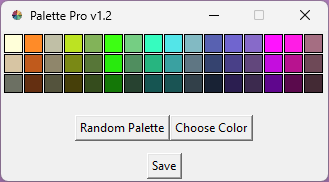
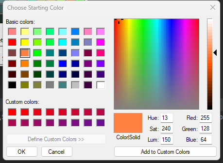
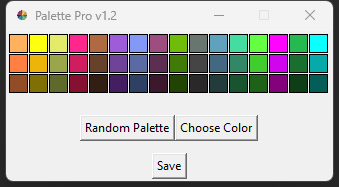
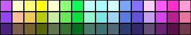

## Palette Pro
This program allows you to create stunning 16-color paint palettes with matching light and dark variants for each color. 

With just a few clicks, you can generate randomized color combinations and save them as beautifully crafted 320x60 PNG grids. It's the perfect tool for designers, artists, and anyone who loves to experiment with colors.

## Update
<a href="https://github.com/JAMadison/Palette_Pro/raw/main/Palette_Pro_v1_2.zip"> Download latest version </a>

Update to v1.2:

-Wider range of color generated

-Variable light and dark color ranges to add more variety

-The left most middle color is your selected color

## Simple GUI

## Select First Color
By selecting the first color you set the tone for the rest of the 15 colors and their varients.

*There is random logic to all the colors, if you select the same color twice you will get a different color palette.*

## Example Palettes

## How to Use
1. Unzip the program to desired location.
2. Open the program.
3. Generate a random palette or chose your starting color.
4. Save the palette as a 320x60 png grid, saved in the same directory as the .exe.
5. Use the palette for your art projects.
