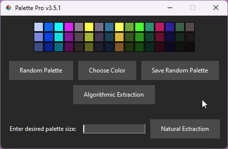
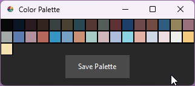
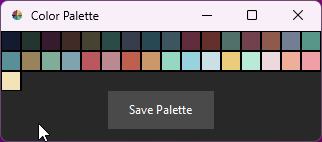

## Palette Pro

Palette Pro is a powerful color palette generator that offers a range of tools for creating and exploring color palettes. With just a few clicks, you can generate randomized color combinations and save them as beautifully crafted 320x60 PNG grids in the palette/ folder.

In version 2.0.0, the Kmeans algorithm method was added, which clusters the pixels in the image into a specified number of groups to generate a color palette. In version 3.0.0, the Colorgram extraction method was introduced, which extracts the dominant colors directly from the image. This gives users two powerful methods for generating color palettes based on existing images.

In version 2.0.1, the program was updated to include a console print out of saved image names, making it easier to keep track of your work.

In version 3.5.1, the program's UI was updated to include a sleek dark mode theme, and the color range was expanded to include grey-scales. Additionally, the natural extraction feature now produces randomized colors from the full palette, providing even more versatility for generating unique color combinations. These updates make Palette Pro the ultimate tool for creating stunning color schemes for your designs and artwork.

## Already have a copy of Palette Pro?

Pull the latest changes from your remote repository using the git pull command. Navigate to your Palette Pro directory and open a CMD window, copy and paste the command below and you are good to go! 

    git pull

## Palette Pro v3.5.1 Release and Install instructions:

Review the code here - https://github.com/JAMadison/Palette_Pro/blob/main/main.py

1. Requires python 3.10+ and Git

Open a command prompt or terminal window.

Change the working directory to where you want to clone your repository. You can do this by running the cd command followed by the path to the directory. For example:

    cd C:\Users\YourUsername\Documents

Clone your repository using the git clone command followed by the URL of your repository. For example:

    git clone https://github.com/JAMadison/Palette_Pro.git

Change the working directory to the root directory of your cloned repository. For example:

    cd YourRepository

Pull the latest changes from your remote repository using the git pull command. For example:

    git pull

Run the run.bat file by typing the following command in the terminal or simply double clicking it:

    run.bat

The first time this is ran it will execute the commands in the run.bat file, which will create a virtual environment, install the required dependencies, and start Palette Pro. After the first time, this will also be how you start Palette Pro.

And that's it! Just follow these steps and Palette Pro should run smoothly on your machine.

## UI Features

* In the updated UI, chose your palette extraction method or generate random palettes.

## Natural Extraction

* Select any image file, and click "Open". See below for examples of color palettes extracted from images. 
  
  # 

* Save your file with various image formats.

* If palette size is left blank or too large of a number was requested, it will default to all the colors avaible to this method.

## Algorithmic Extraction

* Select any image file, and click "Open". * Depending on the available threads on your PC, this could take a bit. *

* A new window will open with your extracted color palette! Here you can save the palette or view individual color tones listed in the bottom right.

This selected the 42 most used colors, determined algorithmically with a slight variation added, meaning, each time it's used on a single image will generate slightly different results.

## Select Color

By selecting the first color you set the tone for the rest of the 15 colors and their varients.

*There is random logic to all the colors, if you select the same color twice you will get a different color palette.*

## Example Random Color Palettes

## Update Notes

- v3.5.1
  
  - Added dark mode UI
  - Expanded color range to include grey-scales
  - Natural extraction now produces randomized colors from full palette

- v3.0.0
  
  - Added Colorgram extraction method
    - Extracts the dominant colors directly from the image

- v2.0.1
  
  - Random palettes now save to palette/ folder
  - Added console print out of saved image name

- v2.0.0
  
  - Added Kmeans algorithm method
    - Clusters the pixels in the image into a specified number of groups to generate a color palette

## Photoshop users:

1. Open Adobe Photoshop and create a new document or open an existing one.

2. Click on the "Swatches" panel to open it (if it's not already open, go to "Window" > "Swatches").

3. In the Swatches panel, click on the drop-down menu icon (the icon with three horizontal lines) in the top right corner and select "Load Swatches".

4. In the file dialog, navigate to the folder where your color_palette.png file is located and select it.

5. If the color_palette.png file is not in indexed color mode, you can convert it by going to "Image" > "Mode" > "Indexed Color" and selecting the "Exact" 
   option in the "Palette" dropdown. Then save the file as a PNG.

6. The color swatches from your color_palette.png file will be loaded into the Swatches panel.

7. To use a color from the palette, simply click on the desired swatch in the Swatches panel. The color will be applied to your currently selected tool or 
   layer.

8. You can also save the loaded color palette as a new swatch library by clicking on the Swatches panel drop-down menu icon and selecting "Save Swatches". Give your new swatch library a name and save it to your desired location.
