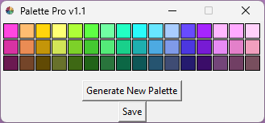

# Palette_Pro
This program allows you to create stunning 16-color paint palettes with matching light and dark variants for each color. 

With just a few clicks, you can generate randomized color combinations and save them as beautifully crafted 320x60 PNG grids. It's the perfect tool for designers, artists, and anyone who loves to experiment with colors.

## Simple GUI

## Example Palettes

## How to Use

1. Open the program.
2. Generate a random palette.
3. Save the palette as a 320x60 png grid.
4. Use the palette for your art projects.
