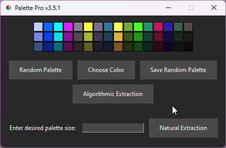

## Palette Pro
This program allows you to create stunning 16-color paint palettes with matching light and dark variants for each color. 

With just a few clicks, you can generate randomized color combinations and save them as beautifully crafted 320x60 PNG grids. It's the perfect tool for designers, artists, and anyone who loves to experiment with colors.

## Palette Pro v2.0 Release
Review the code here - https://github.com/JAMadison/Palette_Pro/blob/main/main.py *I will make a walkthrough for installing and running this code directly.* 

Goto the release page https://github.com/JAMadison/Palette_Pro/releases/tag/v2.0 

https://github.com/JAMadison/Palette_Pro/releases/download/v2.0/Palette_Pro_v2.exe *the .exe was created using <a href="https://github.com/pyinstaller/pyinstaller">pyinstaller</a>*

## New to v2
*Now you can select an image and extract a color palette from that image*

1. Click "Select Image".

2. Select any image file, and click "Open". *Depending on the available threads on your PC, this could take a bit.*

3. A new window will open with your extracted color palette! Here you can save the palette or view individual color tones listed in the bottom right.

This selected the 42 most used colors, determined algorithmically with a slight variation added, meaning, each time it's used on a single image will generate slightly different results.

## Select Color
By selecting the first color you set the tone for the rest of the 15 colors and their varients.

*There is random logic to all the colors, if you select the same color twice you will get a different color palette.*

## Example Random Color Palettes

## Palette From Image

## How to Use
1. Unzip the program to desired location.
2. Open the program.
3. Generate a random palette or chose your starting color. Starting colors are the left most middle tile.
4. Save the palette as a 320x60 png grid, saved in the same directory as the .exe.
5. Use the palette for your art projects.

## New to v2
*Now you can select an image and extract a color palette from that image*
1. Click "Select Image".
2. Select any image file, and click "Open". *Depending on the available threads on your PC, this could take a bit.*
3. A new window will open with your extracted color palette!

This uses an agorithm to select the colors, so each time its ran will generate slightly different results.
